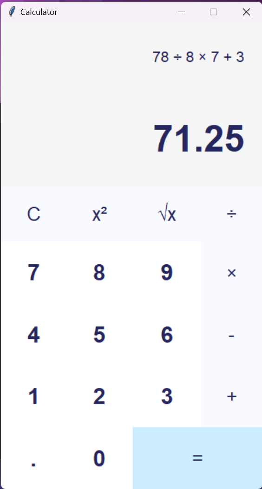

# Calculator App

This is a simple calculator application built using Python's tkinter library. It provides basic arithmetic operations and includes special functions for square and square root calculations.

## Features
- Arithmetic operations: Addition (+), Subtraction (-), Multiplication (*), Division (/)
- Special functions: Square (x²), Square Root (√)
- Clear button (C) to reset calculations
- Keyboard support for digits and operators

## Screenshots



## Usage
1. **Installation**
   - Ensure you have Python installed.
   - Clone the repository:
     ```bash
     git clone https://github.com/KripaBhadani/Python-Projects/tree/main/Easy/Calculator
     ```

2. **Setup**
   - Navigate to the project directory:
     ```bash
     cd calculator
     ```
   - Set up a virtual environment (optional but recommended):
     ```bash
     python -m venv venv
     source venv/bin/activate  # On Windows use `venv\Scripts\activate`
     ```

3. **Run the Calculator**
   - Run the application:
     ```bash
     python calc.py
     ```
   - Alternatively, you can use the executable file `calc.exe`.

4. **Usage**
   - Use the mouse to click on buttons for digits and operations.
   - Keyboard support: Use numeric keys for digits and corresponding keys for operations.
   - Press `Enter` to evaluate the expression.

## Development
- Python version: 3.x
- Libraries used: tkinter

## Contributors
- Kripa Bhadani (kripabhadani29@gmail.com)
